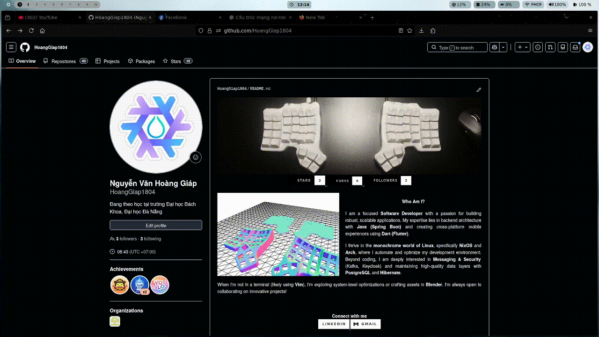

# ❄️ NixOS & Home Manager Dotfiles

<p align="center">
  
</p>

Welcome to my personal configuration repository (dotfiles) for **NixOS** using **Flakes** and **Home Manager**. This configuration is optimized for application development (specifically Flutter, Node.js, and Docker) and entertainment, featuring a modern, smooth, and intuitive **Hyprland** desktop environment.

---

## 🖥️ System Overview

| Component | Tool / Configuration | Details |
| :--- | :--- | :--- |
| **Operating System** | NixOS (Unstable Branch) | `stateVersion = "25.11"` |
| **Window Manager** | [Hyprland](https://hyprland.org/) | Launched via **UWSM** (Universal Wayland Session Manager) |
| **Shell** | Fish Shell | Integrated with **Oh My Posh** for prompt customization |
| **Terminal Emulator** | Kitty | GPU-accelerated rendering support |
| **Application Launcher** | Rofi (Wayland fork) | Fast application launcher and menu |
| **Vietnamese Input** | Fcitx5 + Unikey | Deep system and application integration |
| **Status Bar & Widgets** | Quickshell | Modern and flexible status bar/widget toolkit |
| **Wallpaper Manager** | `swww` | Smooth wallpaper transitions controlled via custom script |
| **Theme** | Catppuccin Mocha Blue Dark | Uses `catppuccin-gtk` |
| **Icon Theme** | Papirus-Dark | Minimalist, sharp icon set |
| **Cursor Theme** | Bibata Modern Ice | Modern and clean cursor theme |

---

## 📂 Directory Structure

```text
.dotfiles/
├── nixos/
│   ├── flake.nix                  # Flake entry point configuration
│   ├── flake.lock                 # Version lock file for inputs (nixpkgs)
│   ├── configuration.nix          # System-level configuration
│   ├── hardware-configuration.nix # Autogenerated hardware configuration
│   ├── home.nix                   # User-level configuration (Home Manager)
│   ├── config/                    # Configuration files to be symlinked to ~/.config
│   │   ├── fastfetch/             # System information display
│   │   ├── fish/                  # Fish shell configurations
│   │   ├── hypr/                  # Hyprland configurations (keybinds, decoration, etc.)
│   │   ├── kitty/                 # Kitty terminal configurations
│   │   ├── nvim/                  # Custom Neovim configurations
│   │   ├── oh-my-posh/            # Oh My Posh prompt configurations
│   │   ├── quickshell/            # Status bar configurations
│   │   └── rofi/                  # Application launcher configurations
│   └── modules/                   # Separate system modules
│       ├── fish.nix               # Fish shell integration & UWSM Hyprland launch
│       ├── network.nix            # Network manager & Firewall rules
│       ├── nvidia.nix             # Hybrid graphics (Intel + Nvidia Prime Sync)
│       ├── properties.nix         # Locales, time zone, and Vietnamese input method (fcitx5)
│       ├── tmux.nix               # Tmux utility configuration
│       ├── users.nix              # Main user declaration (nqim) & group permissions
│       └── window_manager.nix     # Hyprland & Xwayland activation
└── wallpapers/                    # Wallpaper collection & control scripts
    ├── next_wallpaper.sh          # Switch to the next wallpaper
    ├── prev_wallpaper.sh          # Switch to the previous wallpaper
    └── list.txt                   # List of wallpaper file paths
```

---

## ✨ Key Features

### 1. Clean Modular System Design (`nixos/modules/`)
Instead of a monolithic `configuration.nix`, settings are decoupled into specialized module files:
*   `nvidia.nix`: Configures hybrid graphics (Intel + Nvidia Prime Sync) with optimized PCI BusIDs.
*   `properties.nix`: Configures regional settings (Vietnamese locale format `vi_VN` and default timezone `Asia/Ho_Chi_Minh`) along with `fcitx5-unikey` for seamless Vietnamese typing across both Wayland and XWayland.
*   `network.nix`: Opens commonly used development ports (`80, 443, 3000, 8000, 8080, 8765, 5500`) in the firewall.

### 2. Dotfiles Management with Home Manager (`home.nix`)
Binds configuration files from `.dotfiles/nixos/config` directly to the user's `~/.config` directory:
*   Pre-installed high-quality developer fonts like `nerd-fonts.hack`.
*   Complete development environment with toolchains: `VSCode, IntelliJ Idea Ultimate, Flutter, Android Studio, cargo (Rust), Node.js (v22), pnpm, Postman, docker-compose` and CLI utilities like `ripgrep, fzf, htop, lazydocker`.

### 3. Dynamic Wallpaper Daemon
Leverages the `swww` daemon and custom Bash scripts in `wallpapers/` to transition wallpapers with an elegant `wipe` animation (at `60fps` with `1` second transition duration).

---

## 🚀 Installation & Deployment Guide

> [!WARNING]
> Hardware configuration files (`hardware-configuration.nix`) are host-specific. Ensure you copy or generate the correct hardware profile for your machine before deploying.

### Step 1: Clone the repository
Clone the repository to your user's home directory under `~/.dotfiles`:
```bash
git clone https://github.com/HoangGiap1804/dotfiles-nixos.git ~/.dotfiles
```

### Step 2: Copy/Update your hardware configuration
If you are performing a clean install, copy the current system's hardware configuration file:
```bash
cp /etc/nixos/hardware-configuration.nix ~/.dotfiles/nixos/hardware-configuration.nix
```

### Step 3: Build & Apply the NixOS configuration
Run the system rebuild command pointing to your flake configuration (using the host configuration `nqim` defined in `flake.nix`):
```bash
sudo nixos-rebuild switch --flake ~/.dotfiles/nixos#nqim
```

### Step 4: Update packages (optional)
To update all packages to the latest versions from the nixpkgs channel:
```bash
cd ~/.dotfiles/nixos
nix flake update
sudo nixos-rebuild switch --flake .#nqim
```

---

## 🛠️ Keybindings
*Refer to `nixos/config/hypr/keybindings.conf` for the full list of keybinds:*
*   `Super` + `Q`: Open Kitty Terminal.
*   `Super` + `C`: Close active window.
*   `Super` + `M`: Exit active session (Exit Hyprland).
*   `Super` + `E`: Open Nautilus file manager.
*   `Super` + `V`: Toggle window floating state.
*   `Super` + `R`: Open Rofi menu launcher.
*   `Super` + `P`: Toggle Pseudo layout.

---
Have fun configuring your NixOS! 🚀
